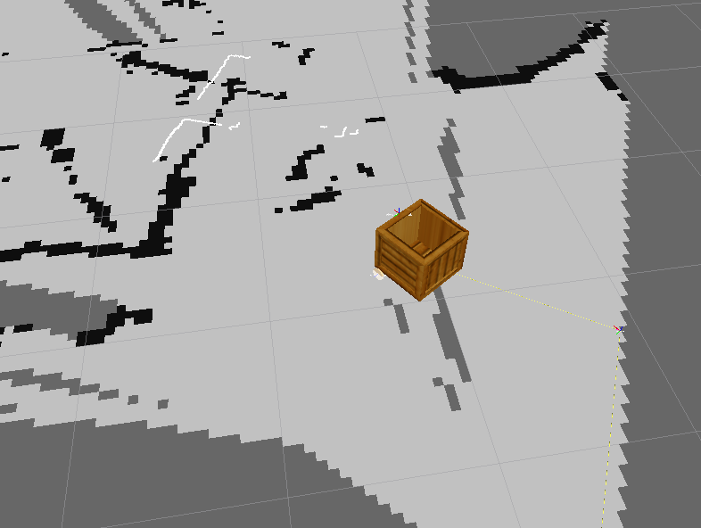

ROS adapter for the EPFL Ranger robot
=====================================

This ROS package provides:

- a set of launch files suitable to create maps or drive around the robot
- a node (`ros_interface`) that expose standard ROS topics for the robot

Dependencies
------------

- [`ranger_description`](https://github.com/severin-lemaignan/ranger_description)
- [`differential_drive`](http://www.ros.org/wiki/differential_drive)
- [`asebaros`](http://www.ros.org/wiki/asebaros)

+ ROS 2D SLAM and navigation tools (`gmapping`, `amcl`, `move_base`...)

